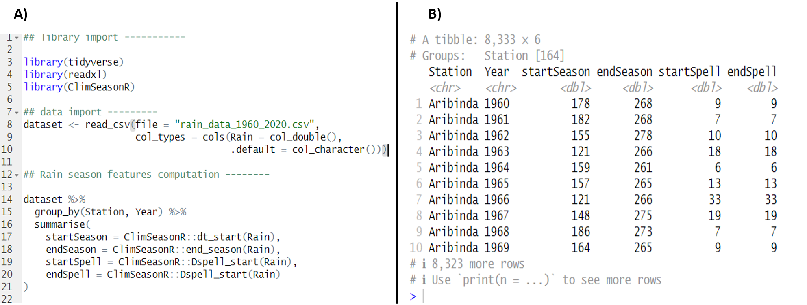

# Summary

`ClimSeasonR` is an R package designed to quantify key agro-climatic attributes of the tropical rainy season—such as onset, cessation, total seasonal rainfall, and dry-spell characteristics—by implementing a rule-based algorithm inspired by Sivakumar’s methodology. Specifically, the onset is detected when a minimum rainfall threshold (e.g., 20 mm over three consecutive days after a specified date) is followed by a bounded dry-spell period (not exceeding seven days within the subsequent 30-day window). The end of the season is determined as the last rainy day after a user-defined Julian day (e.g., day 245) considering soil moisture depletion, approximated by soil capacity and evapotranspiration parameters. `ClimSeasonR` further allows users to compute dry-spell lengths at the beginning and end of the season, as well as throughout the rainy period, using customizable thresholds. The package is tailored for researchers, agronomists, and climatologists focused on improving crop management, climate risk assessment, and hydrological modeling in tropical regions. `ClimSeasonR` enables streamlined multi-station and multi-year analysis by integrating with `dplyr` workflows for grouped summarization. The package is distributed under the GPL-3.0 license and can be installed via GitHub.

# Statement of need

Seasonal rainfall characteristics such as onset, cessation, and dry-spell distribution are critical for agricultural planning, food security, and climate risk management in tropical regions. In semiarid tropical climates with distinct wet and dry seasons, for example in Africa, the date of the start of the wet season is a crucial factor in deciding when to plant crops [@Dodd2001]. Planting too early may lead to crop failure, whereas planting too late may reduce the growing season and hence crop yield [@Dodd2001].
In sub-Saharan Africa in particular, smallholder farmers rely on timely and reliable information about the rainy season to guide sowing dates, crop choice, and resource allocation [@Chisadza2020; @Guido2020]. While several methods have been proposed for determining rainy season metrics, the Sivakumar approach remains widely used in agro-climatology because of its practical balance between climatological rigor and agricultural relevance.

Despite its importance, there is currently no dedicated, open-source R package that provides a reproducible, flexible, and user-friendly implementation of Sivakumar-like algorithms for season onset, end, length, and dry-spell analysis. Researchers often resort to custom scripts, which hampers reproducibility and comparability across studies.

ClimSeasonR addresses this gap by offering a transparent and extensible implementation of rainy season diagnostics fully integrated with the tidyverse ecosystem. The package allows multi-year, multi-station analysis, supports parameter customization, and outputs season metrics in formats directly usable for agronomic, hydrological, and climate-risk studies. By standardizing the computation of rainy season indicators, ClimSeasonR facilitates reproducible research and supports evidence-based decision making for agriculture and climate services in tropical regions.

# Functionality

ClimSeasonR provides a reproducible framework to compute and analyze tropical rainy season characteristics using Sivakumar-like methods. The package is designed to work seamlessly with tidyverse data structures, enabling straightforward integration into modern R workflows.

Key functionalities include:

- **Season Onset and Cessation**: Estimation of the start and end of the rainy season using rainfall thresholds and dry-spell criteria.
- **Season Length**: Computation of the duration of the growing period based on detected onset and cessation dates.
- **Dry-Spell Analysis**: Identification of early- and late-season dry spells, including their duration and frequency.
- **Multi-Year and Multi-Station Analysis**: Batch computation across several stations and years, with outputs aggregated into tidy tables for further statistical analysis or visualization.
- **Parameter Flexibility**: Customizable thresholds (e.g., rainfall accumulation, number of consecutive dry days) to adapt to different agroecological zones or research needs.
- **Integration with Climate Services**: Outputs are directly usable in agricultural advisories, climate risk assessments, and hydrological studies.

The package also includes example datasets and vignettes to demonstrate typical workflows, such as computing season onset dates across multiple years and visualizing interannual variability.

By providing standardized, transparent, and flexible tools, ClimSeasonR enables researchers, meteorological agencies, and practitioners to derive consistent rainy season metrics for agricultural and climate-service applications.

# Usage example

{ width=100% }

The figure above illustrates a practical example of using the package.  
Part **A** shows the R code used, while part **B** presents the corresponding output.  
This example highlights the ability of the package to compute, in a single line of code, the main rainfall season characteristics for each station and each year.  

The resulting columns correspond to different climatic indicators:  
- **startSeason**: the Julian day marking the onset of the rainy season;  
- **endSeason**: the Julian day corresponding to the end of the rainy season;  
- **startSpell**: the length of the dry spell preceding the effective onset of the season;  
- **endSpell**: the length of the dry spell following the end of the season.

# Acknowledgements

We acknowledge support of the National Meteorological Agency of Burkina Faso.

# References

